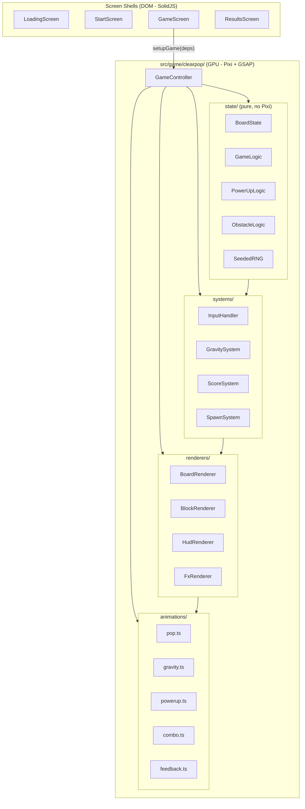

# ClearPop Implementation Plan

Build the ClearPop tap-to-clear puzzle game on the Amino template scaffold: pure game state with seeded RNG, Pixi-based board/block/HUD rendering, GSAP animations, level generation pipeline, obstacles, power-ups, combos, and meta systems (lives, coins, continues). Eight implementation phases from foundation to polish.

## Phases

| Phase | Description | Status |
|-------|-------------|--------|
| 1a | Build pure state layer — types, seeded RNG, board-state, scoring | pending |
| 1b | Generate block/UI sprite assets via MCP tools, create spritesheet, register in asset-manifest | pending |
| 1c | Build BoardRenderer + BlockRenderer (Pixi), GameController (pixi mode), wire into GameScreen | pending |
| 1d | Extend GameTuning with ClearPop params (board, animation, scoring) | pending |
| 2 | Core mechanics — tap detection, flood-fill group finding, clear animation, gravity, refill | pending |
| 3 | HUD renderer (level/goal/moves/stars), score fly-text, win/lose detection and flow | pending |
| 4 | Obstacle system — bubble_block, egg, ice, jelly, cage, safe with adjacency hit logic | pending |
| 5 | Power-ups — rocket/bomb/color burst spawn, detonation, preview overlay | pending |
| 6 | Power-up combos — 6 combo types, 900ms anticipation, heavy feedback | pending |
| 7 | Level generation pipeline — pocket masks, validation rules, gem coloring, symmetry, fallbacks | pending |
| 8 | Polish — juice/feedback tiers, meta systems (lives/coins/continue/DDA), screen updates, audio, accessibility | pending |

---

## Current State

The repo is the **Amino template** with DOM-only placeholder game code. There is no board, no Pixi rendering, no game logic, and no game assets. The existing scaffold provides: asset loading, screen management, audio, tuning, pause, error handling, and viewport sizing.

The screenshot shows the target game screen: an 8x8 grid with glossy rounded blocks (purple, red, orange), rocket power-up icons, a HUD (Level, Goal, Moves, Stars), and the WolfGames logo.

---

## Architecture

All game logic lives in `src/game/clearpop/` (GPU-only, no DOM). Screen shells stay in `src/game/screens/`. Pure state is separated from rendering.



### File Structure

```
src/game/clearpop/
  index.ts                    # setupGame, setupStartScreen exports
  GameController.ts           # Thin orchestrator
  state/
    types.ts                  # CellType, BlockColor, ObstacleType, PowerUpType, BoardCell, GamePhase
    board-state.ts            # Immutable board model + operations
    game-logic.ts             # step(state, action) pure function, group finding via flood fill
    powerup-logic.ts          # Spawn thresholds, detonation patterns, combo selection
    obstacle-logic.ts         # Hit tracking, adjacency resolution
    seeded-rng.ts             # Deterministic random from seed
    level-generator.ts        # Board construction pipeline (Section 13 of vision)
    pocket-styles.ts          # buildSymmetricPocketBubbleMask
    level-configs.ts          # Per-level configs (moves, goals, obstacle types, star thresholds)
    scoring.ts                # 10 * (groupSize ^ 1.5), star calculation
  systems/
    input-handler.ts          # Tap detection, group highlight on hover, invalid tap rejection
    gravity-system.ts         # Column-wise fall calculation + refill positions
    score-system.ts           # Score accumulation, star tracking, bonus sequence
    spawn-system.ts           # New block colors using seeded RNG
  renderers/
    board-renderer.ts         # Grid container, cell positioning, background frame
    block-renderer.ts         # Block sprite pool, color tinting, obstacle overlays
    hud-renderer.ts           # Level, Goal, Moves, Stars — all Pixi Text/Sprites
    fx-renderer.ts            # Particle puffs, confetti, screen flash
  animations/
    pop.ts                    # Block pop sequence (anticipation pulse -> vanish)
    gravity.ts                # Fall tween + landing bounce
    powerup.ts                # Rocket stagger, bomb rings, color burst spiral
    combo.ts                  # 900ms orbit/spiral, heavy shake, confetti
    feedback.ts               # Screen shake, zoom punch, score fly-text
```

---

## Phase 1: Foundation — State Model + Board Rendering

**Goal:** Display an 8x8 grid of colored blocks on a Pixi canvas.

**State layer:**

- `state/types.ts` — define `BlockColor` (3 colors), `CellType` (block, obstacle variants, power-up variants, empty), `BoardCell`, `GamePhase`, `ClearPopState`
- `state/seeded-rng.ts` — mulberry32 or similar PRNG from numeric seed
- `state/board-state.ts` — `createBoard(cols, rows, colorCount, seed)` producing a `BoardCell[][]`; `getCell`, `setCell`, `cloneBoard` operations
- `state/scoring.ts` — `calcGroupScore(size)` = `Math.round(10 * Math.pow(size, 1.5))`

**Rendering:**

- `renderers/board-renderer.ts` — Pixi `Container`; uses `calculateTileSize(8, availW, availH, gap)` from `src/core/config/viewport.ts` to size tiles; creates child `Container` per cell
- `renderers/block-renderer.ts` — Object pool of block sprites; assign tint per `BlockColor`; glossy highlight via pre-baked atlas frame (or `Graphics.roundRect` for prototype)

**Controller:**

- `GameController.ts` — creates Pixi `Application`, sets up layers (`bgLayer`, `boardLayer`, `hudLayer`, `fxLayer`), calls `BoardRenderer.init()`, renders initial board from state
- `index.ts` — export `setupGame` with `gameMode: 'pixi'`
- Wire into existing `src/game/screens/GameScreen.tsx` (redirect import from `mygame` to `clearpop`)

**Assets:**

- Generate block sprites (128x128 rounded squares, 3 color variants + obstacle overlays) using the MCP asset gen tools, pack into a spritesheet
- Register as `scene-clearpop-blocks` in `src/game/asset-manifest.ts`

**Tuning:**

- Extend `src/game/tuning/types.ts` with `ClearPopTuning`: `board: { cols, rows, colorCount }`, `animation: { fallDuration, bounceDuration }`, `scoring: { star1, star2, star3 }`

---

## Phase 2: Core Mechanics — Tap, Clear, Gravity, Refill

**Goal:** Player taps a block, connected same-color group clears, blocks fall, new blocks fill from top.

**State:**

- `state/game-logic.ts` — `findGroup(board, row, col)` via BFS/flood fill; `clearGroup(board, cells)` returning cleared positions; `applyGravity(board)` returning fall movements `{from, to, distance}`; `refillBoard(board, rng)` returning new block positions

**Systems:**

- `systems/input-handler.ts` — listen to `pointertap` on board container; convert pointer position to grid `(row, col)` via tile size math; call `findGroup`; if group size >= 2, trigger clear; if size < 2, trigger rejection
- `systems/gravity-system.ts` — takes fall movements from state, returns animation descriptors

**Animations:**

- `animations/pop.ts` — per-block: anticipation scale then alpha/scale to 0 with destroy on complete
- `animations/gravity.ts` — per-block: y tween with power2.in ease, then scale bounce on landing

**Sequence:** tap -> find group -> animate pop -> update state -> apply gravity -> animate fall -> refill -> animate new blocks dropping in -> unlock input

**Move counter:** Decrement on each valid tap; check win/lose after each move

---

## Phase 3: HUD + Scoring + Win/Lose

**Goal:** Show Level, Goal, Moves, Stars during gameplay. Detect win (all blockers cleared) and loss (moves = 0 with blockers remaining).

**HUD Renderer (`renderers/hud-renderer.ts`):**

- All Pixi `Text` objects positioned above the board (matching screenshot layout)
- Level number (left), Goal icon + count (center), Moves number (right)
- Star indicators below moves (3 stars, fill based on score thresholds)
- Moves counter pulses red when <= 5 remaining

**Score system (`systems/score-system.ts`):**

- Accumulate score per clear; fly-text animation from clear position upward
- Star thresholds from level config

**Win/Lose flow:**

- Win: last blocker cleared -> remaining moves bonus sequence (each move spawns a rocket, fires, adds points) -> navigate to `results` screen
- Lose: moves = 0 with blockers -> dark overlay -> "Out of Moves" -> navigate to `results`

**Update `src/game/state.ts`:**

- Add `stars`, `movesRemaining`, `currentLevelConfig`, `blockerCount` signals

---

## Phase 4: Obstacles (Bubble Block + Egg first, rest incremental)

**Goal:** Implement the 6 obstacle types per vision Section 8.

**State (`state/obstacle-logic.ts`):**

- `ObstacleState` with `hitPoints` per cell
- `resolveAdjacencyClear(board, clearedCells)` — for each cleared cell, check orthogonal neighbors; decrement hit points on adjacent obstacles; remove at 0
- Obstacle types: `bubble_block` (1 HP), `egg` (2 HP, wobble/crack), `ice` (3 HP, covers a block), `jelly` (1 HP, anchors block), `cage` (1 HP, traps block), `safe` (2 HP)

**Rendering:**

- Each obstacle type gets distinct atlas frames (overlay on top of block sprite or standalone)
- Hit feedback: sprite shake on damage, crack texture swap for multi-hit obstacles
- Ice: translucent overlay sprite on the block
- Cage: wireframe overlay

**Level configs:** obstacles appear per the introduction schedule (bubble_block L1, egg L4, ice L12, etc.)

---

## Phase 5: Power-Ups

**Goal:** Large groups spawn power-ups; tapping a power-up activates it.

**State (`state/powerup-logic.ts`):**

- Spawn rules: group size 5 -> Rocket, 7 -> Bomb, 9+ -> Color Burst
- `spawnPowerUp(board, tapRow, tapCol, groupSize)` — places power-up at tap location
- `detonateRocket(board, row, col, direction)` — clears full row or column; direction from group shape analysis
- `detonateBomb(board, row, col)` — clears 5x5 zone (radius 2)
- `detonateColorBurst(board, row, col, color)` — clears all blocks of that color

**Animations (`animations/powerup.ts`):**

- Rocket: stagger clear outward at 50ms per cell
- Bomb: expanding ring at 40ms per ring
- Color Burst: spiral clear at 60ms per cell

**Input:**

- Tapping a power-up costs 1 move, triggers its detonation
- Power-up preview: on hover/hold over a qualifying group, show faint power-up icon overlay

---

## Phase 6: Power-Up Combos

**Goal:** Adjacent power-ups combine for amplified effects per the combo matrix.

**State (`state/powerup-logic.ts` extended):**

- `findBestComboPartner(board, row, col)` — check orthogonal neighbors for other power-ups; pick the one that clears the most
- Implement all 6 combo types from the vision matrix

**Animations (`animations/combo.ts`):**

- 900ms anticipation orbit/spiral
- Heavy screen shake + camera zoom punch
- Maximum confetti from `fx-renderer`
- Unique combo blast sound

---

## Phase 7: Level Generation Pipeline

**Goal:** Procedural board generation per vision Section 13.

**Files:**

- `state/pocket-styles.ts` — `buildSymmetricPocketBubbleMask(cols, rows, seed)` generating left-right symmetric masks
- `state/level-generator.ts` — full pipeline:
  1. `createPocketFirstBubbleBoard` (32 seed attempts)
  2. `validateBubbleStructureRules` (7 rules: coverage 60-85%, exposure 10-25%, cohesion 70%+, no small clusters, checkerboard cap, no solo gems, top-entry bias, perimeter gems)
  3. `assignGemColorsHorizontalBands` (2-row stripes, max group size 6, flood fill check)
  4. `mirrorHorizontalPlayableGemCells` (left-to-right symmetry)
  5. `applyEggRowPattern` (level 4+, rotating patterns)
  6. Final validation (has valid groups, no solo gems, minimum gem count)
  7. Fallback cascade (random perimeter expansion -> plain procedural -> last resort)
- `state/level-configs.ts` — 200 levels across 10 zones; per-level: `moves`, `colorCount`, `obstacleTypes[]`, `starThresholds`, `seed`

---

## Phase 8: Polish, Meta Systems, Screens

**Juice and feedback (`animations/feedback.ts`):**

- Three-tier feedback system per vision Section 11
- Screen shake (GSAP on board container pivot), zoom punch, confetti particles
- Score fly-text with easing
- Rejection shake + thud sound for invalid taps
- Moves counter pulse animation at <= 5

**Meta systems (extend `state.ts` and add to `clearpop/`):**

- Lives system: 5 max, 1 lost per failure, 30min regen
- Continue system: pay coins for +5 moves, escalating cost (50/75/112), max 3 per attempt
- Coin economy: earn on clear, spend on continues/lives
- DDA: after 2-3 consecutive failures, +2 bonus moves + friendlier board

**Screens:**

- Update `src/game/screens/StartScreen.tsx` — level select or "Play" button, show current level/lives/coins
- Update `src/game/screens/ResultsScreen.tsx` — stars earned, score, coins, continue offer on loss
- Update `src/game/screens/LoadingScreen.tsx` — load `scene-clearpop-*` and `audio-*` bundles

**Audio:**

- Pop sounds (pitch-scaled to group size)
- Power-up detonation SFX
- Combo blast SFX
- Rejection thud
- Win/lose stingers
- Background music

**Accessibility:**

- Colorblind support: unique shape per color (circle, diamond, square)
- `prefers-reduced-motion`: disable shake, reduce particles, shorten animations
- 44x44dp minimum touch targets (enforced by tile sizing)

---

## Asset Generation Strategy

Use the `user-wolfgames-asset-gen` MCP tools:

1. `generate_style_sprites` — block sprites (3 colors x normal + each obstacle overlay), power-up icons (rocket, bomb, color burst), star icons, HUD elements
2. `pack_spritesheet` — combine into `scene-clearpop-blocks` atlas
3. `generate_sfx` — pop, explosion, whoosh, thud, win/lose stingers
4. Register all in `src/game/asset-manifest.ts` with correct `scene-*` / `audio-*` prefixes

---

## Key Guardrail Compliance

- No DOM in `src/game/clearpop/` — all Pixi
- GSAP for all animation — no `requestAnimationFrame`
- `eventMode = 'passive'` on parent containers, `'static'` on interactive blocks
- Kill tweens before destroy, correct destruction order
- `scene-*` prefix for GPU bundles
- No per-frame allocations — block sprite pool
- Pure game state — seeded RNG, no `Math.random()`, no Pixi in state layer
- SolidJS for screen shells — `createSignal`, not `useState`
- Bun only — `bun add`, `bun.lock`
